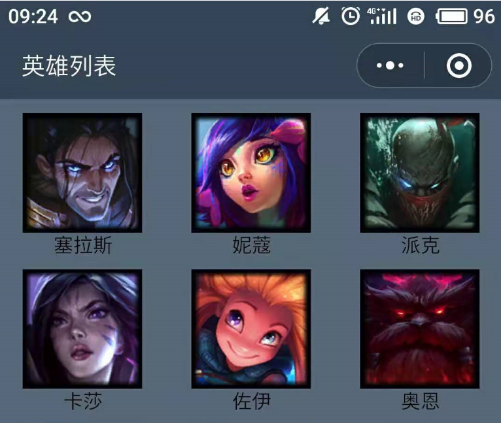

# 微信小程序学习第二天


## 编程式导航

1. 声明式导航

   1. vue-router

      ```html
      <router-link path="/sing"></router-link>
      ```

   2. 微信小程序

      ```html
      <navigator url="/pages/index/index"></navigator>
      ```

2. 编程式导航

   1. vue-router

      ```js
      router.push('/sing')
      ```

   2. 微信小程序

      ```js
      wx.navigateTo({url:'/pages/index/index'})
      ```

> 微信小程序里面很多方法是由wx对象提供的

>1. 这一节我们来学习一下编程式导航，当然这里指的是小程序的编程式导航。vue里面的声明式导航和编程式导航分别是？小程序里面的导航也有两种，我们昨天学习的navigator组件是什么导航？声明式导航。那么可以想一下，小程序的编程式导航写在哪里呢？
>2. 新建一个项目，复习声明式导航。
>3. 我们再来实现编程式导航。绑定事件，在事件处理方法里面需要跳转到新的页面。
>4. 怎么跳呢？查看文档wx.naviagateTo
>5. 微信小程序里面很多方法是由wx对象提供的


## 事件传参

注册事件：

```html
<view bindtap="fn" data-参数名="参数值">
```

事件处理方法：

```js
fn(event){
  event.currentTarget.dataset.参数名
}
```


>1. 在昨天的案例里面，我们用声明式导航跳转页面，而且传递了id。如果我们用编程式导航，如何传递参数呢。这个就是涉级到小程序里面的事件传参了。
>2. 我们是否可以在注册事件时传递参数？并不行。
>3. 小程序的语法。形参event，打印一下event.
>4. event里面其实有两个参数可以取得参数。currentTarget当前dom, target是事件源dom。
>5. 传递参数到url中，成功在跳转后的页面取得参数


## 编译模式的设置

作用： 设置模拟器的默认首页，方便调试

操作： 工具栏中的普通编译->添加编译模式

>1. 在上面这个例子里面，我们在跳转后的页面上改代码，保存后，模拟器刷新后去到首页，我又得从首页点击才去到跳转后的页面。那么如果我想一直保持在第二个页面上呢？需要设置编译模式
>2. 默认是普通编译，就是取app.json里面配置的pages的首个页面作为首页。
>3. 自定义首页需要添加编译模式。启动页面就是用来选择首页
>4. 如果这个首页需要参数，就设置启动参数


## lol英雄案例介绍



> 1. 看一下这个案例长什么样呢。展示案例图片，发送给大家
> 2. 页面数据发给大家。
> 3. 新建项目，删除掉无用的页面


## lol英雄案例-英雄列表页

#### 01-静态页面

1. 添加一个英雄列表页
2. 静态页面
3. 数据渲染

>1. 添加一个英雄页面
>2. 先完成静态页面，结构+样式
>3. 导入数据，wx:for渲染数据展示列表

#### 02-导航区设置

[传送门](https://developers.weixin.qq.com/miniprogram/dev/reference/configuration/page.html)

pages/home/index.json设置

1. 背景颜色
2. 文本
3. 文本颜色

```json
{
  "navigationBarBackgroundColor": "#354459",
  "navigationBarTitleText": "英雄列表",
  "navigationBarTextStyle": "white"
}
```

> 1. app.json是项目的配置，pages下页面有.json文件是对页面的配置
> 2. 查看文档，看示例如何设置
> 3. 应用到案例里面


## lol英雄案例-英雄详情页

#### 01-跳转到详情页

1. 编程式导航
2. 设置编译模式

> 1. 添加一个详情页面
> 2. 编程式导航跳转到详情页面
> 3. 设置编译模式，默认页面设置为英雄详情页

#### 02-静态页面-轮播图组件

[传送门](https://developers.weixin.qq.com/miniprogram/dev/component/swiper.html)

> 1. 接着我们来写详情页面结构
> 2. 设置background-color
> 3. 轮播图组件，copy代码，添加图片数据。

#### 03-静态页面-其他内容

[progress](https://developers.weixin.qq.com/miniprogram/dev/component/progress.html)


#### 04-渲染数据

1. 引入lol_details_duowan.js
2. 根据id获取当前英雄的数据
3.  英雄的数据渲染到页面上

#### 05-导航区设置

1. 动态设置导航 wx.setNavigationBarTitle

> 1. 导航区需要怎么设置呢？需求图片上
> 2. 动态设置导航

## 小程序上线

1. 开发者工具
   1. 上传为体验版本
2. 小程序后台管理
   1. 开发版本提交审核
   2. 审核版本审核中
   3. 审核通过后，就上线成功

> 1. 模拟器里面小程序只能自己访问到，如果想让其他人访问到，需要发布上线。
> 2. 在开发者工具里面点上传，上传为体验版本
> 3. 去到小程序后台管理去查看体验版本，提交审核
> 4. 审核版本再提交审核


## mpvue介绍

[传送门](http://mpvue.com/)

用Vue的方式来写小程序，支持发布多个平台的小程序

> 1. 到此为止，我们微信小程序的基础语法基本学习完了。小程序的语法大家感觉如何呢？是不是类Vue语法。那么大家有没有想过，为什么微信小程序开发不直接使用vue的语法呢？其实原理上完全可以使用vue的语法的。另外我们知道除了微信有小程序，还有支付宝小程序，头条小程序，百度智能小程序等等。那么我们得给每个小程序平台写一套代码？这样的话，让企业就能养更多的前端程序员啦。
> 2. 当然公司老板当然不希望养更多的程序员，老板希望一套代码能发布多个小程序。这种一套代码支持多端的框架，叫多端框架。多端框架里面比较有名的有mpvue.
> 3. 传送门去到官网。mpvue这个框架就让我们可以用vue的方式来写小程序，而且支持发布多个平台的小程序。它也是一个外卖公司开源的框架，美团的。
> 4. 实践案例，去到github地址看一下使用mpvue完成的小程序
> 5. 名字的由来，mp就是小程序的意思
> 6. 主要特性，可以使用vue的语法
> 7. mpvue美中不足，目前不支持生成h5，可能兼容性不好处理。


## mpvue快速上手

[传送门](http://mpvue.com/mpvue/quickstart.html)

#### 01-初始化mpvue项目

1. 设置npm淘宝源

   ```bash
   npm set registry https://registry.npm.taobao.org/
   ```

2. 安装vue-cli@2.x版本,全局安装一个桥接工具

   ```bash
   npm install -g @vue/cli-init
   ```

3. 创建项目

   ```bash
   vue init mpvue/mpvue-quickstart 项目名
   ```

4. 运行项目

   1. 进入项目目录

      ```bash
      cd 项目名
      ```

   2. 安装npm包

      ```bash
      npm i
      ```

   3. 运行项目

      ```bash
      npm run serve
      ```

> 1. 我们来结合文档的快速上手来完成一个mpvue的小demo
> 2. 首先需要初始化一个mpvue项目
> 3. nodejs和npm都安装了。设置npm淘宝源需要注意下，直接把npm下载源设置为淘宝源，不然npm安装会慢。
> 4. 然后需要安装vue-cli, vue-cli我们有安装吗？有，我们安装的是3.x版本，但是文档要求安装2.9版本。vue-cli 3.x不能执行vue init命令的。难道我们要把vue-cli 3.x卸载？能否让两个版本共存呢？
> 5. vue-cli桥接全局安装vue2.x
> 6. 接着我们来创建mpvue项目，查看工程目录，和vue create生成的项目结构非常类似
> 7. 然后install, 运行。没有提示我打开页面，我localhost:8080访问一下，不行。发生什么了。我们看一下项目目录，发现生成了一个dist目录。dist/wx下目录结构和微信小程序的目录结构一样。


#### 02-调试开发 mpvue

1. 微信开发者工具导入项目，导入目录选择`项目名`，而不是`项目名/dist/wx`

2. 建议用vscode来写代码，用微信开发者工具来查看效果。

> 1. 我们用开发者工具打开项目，导入，选择项目名即可。为什么呢，先导入再解释
> 2. project.config.json告诉开发者工具小程序的源码位置
> 3. 那么我们写代码在微信开发者工具里面写吗？其实也可以用vscode开发，在微信开发者工具里面看模拟器效果即可。
> 4. 演示vscode写代码，用微信开发者工具来查看效果。


## mpvue项目结构

1. build和config目录是打包相关
2. dist是打包后的文件
3. src源码目录
   1. components 组件目录
   2. pages页面，每个小程序页面一个单独目录
      1. 必须有一个**mian.js**
   3. utils工具（可选）
   4. main.js 入口文件
   5. App.vue主组件
   6. app.json 小程序配置文件，管理了所有页面路径
4. static目录 静态资源文件
5. 其他根目录下文件和vue create生成的项目一样的
   1. project.config.json微信开发者工具的配置文件

> 1. 我们先来近距离看一下mpvue给我的生成的文件夹及文件。总的来说，和vue create创建的项目很类似
> 2. build和config是什么？跟打包相关的。
> 3. dist当是打包后的文件
> 4. src是源码目录，代码写在这里
> 5. static呢。这个英文是啥意思，静态。也就是静态文件夹，存放静态资源的。
> 6. utils就是存放一些工具类库
> 7. main.js是入口文件
> 8. App.vue是主组件
> 9. app.json是什么。和小程序里面的一样，是小程序的配置文件。
> 10. 回头再具体看看src目录下的文件。src目录下的文件会转成小程序文件，其中pages目录就是转成小程序的pages目录，main.js和App.vue转成app.js，app.json，app.wxss等等
> 11. 在main.js里面.productionTips一样的，生产信息提示。new Vue这里是创建一个Vue实例吧，其实不是。import Vue from 'vue‘是在node_modules里面找一个vue文件夹？并没有，这里其实是webpack里面配置的一个别名，找的是mpvue。所以这个Vue就是mpvue。这也是为什么我们new Vue（）可以传一个组件进去的原因。mpvue里面对Vue这个类进行改写。相关的文档也不全，大家先参照这种写法就行。App.myType这个是小程序实例的类型，这里跟页面的小程序实例区分开来。我们可以看到pages/目录/main.js也创建一个小程序实例。作一个区分，固定写法，参照这样写就行。
> 12. App.vue 主组件，在main.js被实例化
> 13. app.json和小程序里面的一样。我们来对比一下打包后的app.json。其中pages属性配置了页面路径，指向一个main.js
> 14. 找到pages/**/main.js，在这里实例化了index.vue
> 15. 我问一下,main.js和index.vue的名字能改吗？能吗？我们试试。不行。为什么。因为webpack有配置读取pages/**/main.js文件。所以注意了pages/目录/main.js文件是固定的。mpvue这个框架本身设计得不是那么自然，适应它。

## 创建自己的页面

1. app.json
   1. pages中添加路径 pages/demo/main
2. pages目录
   1. 在pages中添加文件夹demo
   2. 在demo中添加文件
      1. main.js
      2. index.vue
3. 中断，再执行npm run start

> 1. 理解了mpvue的项目结构，现在我们来添加一个页面。
> 2. 首先在app.json添加一个页面路径。
> 3. 其实我们并没有这个页面，需要真正地添加页面，在哪里添加呢。pages目录下，添加/demo/main.js
> 4. 然后copy隔壁index/main.js里面的内容，在main.js引入了index.vue。所以我们还需要一个demo/index.vue文件。里面的内容给个文案hello world
> 5. 需要中断npm的运行，重新执行npm run start。为什么呢，我们打开webpack配置文件，当我们npm run start时，entry指定了webpack去监听哪些文件。如果我们再新增文件，webpack其实是不会监听到的。所以需要中断再执行npm run start
> 6. 另一个更简洁的文式，创建自己的页面，直接copy一个pages/目录，然后改吧改吧。记得重启npm run start


## mpvue重构lol

#### 01-创建项目

1. 创建mpvue-lol项目

   ```bash
   vue init mpvue/mpvue-quickstart mpvue-lol
   ```

2. 运行 mpvue-lol

   ```bash
   cd 项目目录
   npm install
   npm run start
   ```

3. 微信开发者工具中导入项目

> 1. 回顾一下怎么创建项目的
> 2. 需要运行起来才会生成小程序文件吧。
> 3. 在微信开发者工具中导入项目
> 4. 至此我们就可以在vscode里面写代码，在微信开发者工具中查看效果了

#### 02-英雄列表静态页面

1. 创建页面
2. 静态页面
3. 数据渲染

> 1. 接着我们先来完成英雄列表静态页面。怎么做呢，是不是得先创建页面，然后写静态页面，再结合数据来渲染呢。
> 2. 删除掉无用文件和无用代码,app.json里tabbar也要去掉，npm run start
> 3. 静态页面
> 4. 渲染数据
> 5. 不能使用小程序的语法
> 6. 查看最终渲染结果，检查wxml。

#### 03-英雄列表设置导航

添加main.json，再添加配置

> 1. 接着我们再来设置导航,在小程序里面设置页面导航是不是到页面目录里去设置的。我们看一眼打包后的dist目录。main.js main.wxml。。。我们说mian.js这个名字是不是能改的，那么需要添加的配置文件的名字，必须也是main.json
>
> 2. 添加生效

#### 04-点击英雄跳转英雄详情

1. 创建英雄详情页面`pages/detail/main`
2. 注册事件@click:toDetail(item.id)
3. toDetail里面wx.navigateTo

##### 注意点：

在mpvue里面wx对象依然可以使用

#### 05-英雄详情页面

直接copy原来小程序的结构和样式代码到detail/index.vue里面，指令的语法修改为Vue的。

##### 注意点:

在mpvue里面小程序的组件和wx对象依然可以使用

> 1. 接着我们来整详情页面。轮播图组件，这里是否可以直接使用小程序的轮播图组件呢？我们试试。可以。
> 2. 其实在mpvue里面，可以直接使用小程序的组件。
> 3. 那我有个大胆地想法，直接把原来小程序的结构和样式代码copy过来。hero数据用假数据渲染。报错，一项一项解决
> 4. 报错的都是都是指令相关的，需要改成Vue的指令。

#### 06-英雄详情动态渲染数据

1. 在onLoad钩子函数里面获取参数
2. 修改数据直接 this.hero =
3. 添加main.json设置导航栏背景色和字体颜色
4. 动态设置标签文案

> 1. 接着我们在英雄详情里面用真实数据渲染，那么就需要接受参数。记得我们在小程序页面如何接受参数的？onLoad(options)对吧。在mpvue里面也可以使用。
> 2. 修改数据直接用this.hero,不需要用this.setData()
> 3. 然后设置导航的背景色和字体颜色
> 4. 动态设置标题文案，wx对象依然可以使用。


## mpvue生命周期图示

[传送门](http://mpvue.com/mpvue/#%E7%94%9F%E5%91%BD%E5%91%A8%E6%9C%9F%E5%9B%BE%E7%A4%BA)

小程序页面切换的时候，最先触发onLoad钩子函数

> 1. 刚才在英雄详情里面用onLoad钩子函数获取页面参数，能够用vue的生命周期钩子函数吗？试试，并不行。
> 2. 我们说mpvue里面的Vue其实是mpvue修改过的Vue类。它的生命周期和Vue有些不一样。
> 3. 看mpvue生命周期图示，mpvue增加了一些钩子函数，就中间这块。因为在打开小程序后就会初始化所有的页面，也就是说各页面的created方法都会触发了。
> 4. 小程序页面切换的时候，最先触发onLoad