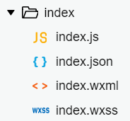

# 微信小程序学习第一天


## 基本介绍

1. 基本概念（是什么）

   1. 运行在微信中
   2. 迷你的应用程序

2. 使用

   1. 只要有微信就可以运行

3. 有什么用

   1. 目前很多公司都把小程序作为推广的渠道
   2. 工具类
   3. 电商购物
   4. 。。。


> 1. 今天来学习微信小程序，相信大家都用过的。在微信里面，下拉就可以看到很多微信小程序。比如乘地铁用的乘车码，坐公交用的深圳通，购物用的拼多多，等等。
> 2. 那么微信小程序是什么呢，我们这里给一个概念。微信的小程序，也就是运行在微信中的迷你应用程序。
> 3. 依据它的这个特点，那么微信小程序的使用，就是只要有微信就可以运行啦。苹果手机，安卓手机，哪怕是电脑模拟器装个微信都可以运行小程序。
> 4. 以上我们说的乘车码，深圳通，拼多多这些小程序是做什么的呢。前两者是工具类，拼多多和京东是购物类。其实更多时候，一些公司把小程序作为推广渠道。比如公司本身有自己的App，然后开发一套微信小程序，功能上相对于App是阉割版的，通过微信小程序引流到App。


## 微信小程序官方文档

[传送门](https://mp.weixin.qq.com/cgi-bin/wx)

>1. 当然我们作为程序员不能仅仅使用小程序啦，我们需要开发小程序。搜索一下微信小程序官网。
>2. 我们看重要的信息，开发文档，这个是写给程序员看的，对吧。开发时候，需要经常查看的。
>3. 再看到接入流程，也就是我们真正写代码前需要做两步，注册账号和安装微信开发者工具。


## 注册账号

[微信公众平台](https://mp.weixin.qq.com/)

#### 正常流程

1. 注册选择 小程序
2. 填写邮箱、密码，注册
3. 邮箱激活
4. 信息登记
   1. 主体类型选个人。其他需要上传认证资料的。
5. 填写小程序信息
   1. 服务类目最好选工具，比较容易上线

#### 注意点

1. 邮箱已经注册过公众号和订阅号，是不能用来注册小程序
2. 邮箱绑定了微信，可以解绑。微信->设置->账号与安全->更多安全设置->删掉邮箱
3. 小程序的名字，好的名字已经取不到了。
4. 小程序头像需要选一些健康，内容积极向上的图片

> 1. 那么账号怎么注册呢。正常流程及需要注意点
> 2. 留时间，让同学们的微信小程序账号注册成功


## 微信开发者工具安装及使用

[微信开发者工具](https://developers.weixin.qq.com/miniprogram/dev/devtools/devtools.html)

#### 新建项目

1. 需要一个小程序的 [AppID](https://developers.weixin.qq.com/miniprogram/dev/framework/quickstart/getstart.html#申请帐号)；如没有 AppID，可以选择申请使用[测试号](https://developers.weixin.qq.com/miniprogram/dev/devtools/sandbox.html)。
2. 登录的微信号需要是该 AppID 的开发者；

#### 注意点：

如果没有账号可以用测试号

> 1. 可能有同学注意到了，注册完微信小程序，有提示让下载微信开发者工具的。的确微信官方为方便我们开发微信小程序，特意搞了一个开发工具。这个工具呢，上手也比较简单，快捷键基本和vscode一致。
> 2. 这个微信开发者工具的下载链接，我给一下。大家下载一路确定安装。
> 3. 打开微信开发者工具，扫码登陆，创建helloworld项目，点确定。可以看到模拟器显示文案hello world.


## 微信开发者工具

开发者工具主界面，从上到下，从左到右，分别为：菜单栏、工具栏、模拟器、编辑器、调试器 五大部分。

1. 菜单栏
   1. 新建项目
   2. 设置-外观设置-设置成黑色
2. 工具栏
   1. 模块显示/隐藏按钮，至少需要显示一下模块
   2. 编译就是重新构建
   3. 预览可以拿手机扫码，在手机上看到效果
   4. 上传 上传代码到腾讯的服务器，让别人也能访问到
3. 编辑器写代码的，可以理解为vscode。快捷键和vscode基本差不多的。编辑器写代码保存，模拟器会立马刷新
4. 模拟器和chrome里面差不多
5. 调试器同chrome的开发者工具差不多
   1. console看到打印信息
   2. source看到代码，方便打断点调试
   3. network查看请求信息
   4. wxml看到页面结构


> 1. 首先来简单介绍一下微信开发者工具
> 2. 它总共分为五大部分。从上到下，从左到右，分别为：菜单栏、工具栏、模拟器、编辑器、调试器
> 3. 其中大家有没有发现模拟器和调试器很像呢？其实整个微信开发者工具是内嵌了一下chrome内核。所以模拟器和调试器同chrome是很像的。体现了腾讯的强大的模仿能力是吧？
> 4. 好。我来简单介绍一下，常用的一些功能。


## 小程序开发原理

小程序的开发

类似于基于vue-cli的Vue 项目的开发

技术栈：

1. wxml布局
2. wxss样式
3. js逻辑
4. json配置信息

> 那么如何开发一款小程序呢？我们说微信小程序是运行在微信里面的，准备来说是运行在微信提供的手机浏览器内核里面。所以写微信小程序跟我们写H5基本上一样，注意我说是基本上。回顾一下我们做H5页面用了哪些技术，html,css,js对吧。其中html是布局，css是样式，js是逻辑对吧。微信小程序的开发并不能完全用H5的这些技术，微信小程序官方做了一些封装，写起来语法稍有不同。总的来说类似于我们学过的基本vue-cli的vue项目的开发。那么小程序的技术栈是由布局文件wxml、样式文件wxss、逻辑文件js组件，额外还有一个json文件，包括配置信息。wxml对应到html...,不用怕，代码写得跟以前跟H5差不多的。

## 项目结构介绍

1. app.js 全局逻辑，类似Vue脚手架里面的根实例
2. app.json 全局配置，包括了小程序的所有页面路径、界面表现、网络超时时间、底部 tab 等
   1. pages 让微信知道小程序页面所在的路径，第一个路径就是模拟展示的那个页面
   2. window 小程序所有页面的顶部背景颜色，文字颜色定义
3. app.wxss 全局样式
4. project.config.json 开发工具的个性化配置
5. sitemap.json 配置小程序及其页面是否允许被微信索引

> 1. 跟我们的vue-cli创建项目一样，微信开发者工具给我们创建了很多文件。我们来看一下项目结构。
> 2. 外层的app.js是全局逻辑，类似Vue脚手架里面的根实例
> 3. app.json全局配置，pages让微信知道小程序页面所在的路径。第一个路径就是模拟展示的那个页面。window小程序所有页面的背景和颜色
> 4. 既然都是全局配置，app.wxss也不例子，就是全局样式
> 5. project.config.json是开发工具个性化配置，包括编译设置等。不同微信开发者工具打开，保证配置一样的。
> 6. sitemap.json 配置小程序及其页面是否允许被微信索引


## 页面文件分析



1. index.wxml页面的结构，组件名当标签使用
2. index.js是页面逻辑，语法和Vue很像
3. index.wxss页面样式，基本的css样式都可以使用
4. index.json页面配置，页面配置优化于全局配置

也是基于数据驱动的，语法和Vue很像。

> 1. 我们说app.json的pages属性，是一个路径数组。一个路径就是一个页面。比如`pages/index/index`是指pages/index目录下`index文件名后缀`的文件最终合在一起组件一个页面。结构、逻辑、 样式及页面配置是分开来写的。
> 2. 比如index页面，index.wxml是页面结构，index.js是页面逻辑，index.wxss是页面样式，index.json是页面的配置信息
> 3. wxml页面结构里面不能直接写html标签,div，p标签用不了。但是微信小程序提供了丰富的组件，在页面结构里面可以把组件名当标签使用
> 4. js页面逻辑，类Vue语法，也是基于数据驱动的
> 5. wxss页面样式，基本的css样式都可以使用。
> 6. index.json局部配置优先于全局的配置

## 基本标签的使用

[组件](https://developers.weixin.qq.com/miniprogram/dev/component/)

组件名当标签使用

1. text文本标签
2. view 视图容器
3. image图片
4. button按钮

> 1. helloworld这个例子是微信开发者工具帮我们自动生成的，我们来自己写点东东。写小程序和我们写H5页面一样，也是先写结构和样式，再写逻辑。那么这一节呢，我们来写点结构，会使用到小程序里面基本标签的使用。
> 2. 我们在app.json里面新建一个路径，它会自动帮我们生成目录和文件
> 3. 打开hello/index.wxml文件，看到一个text标签，不难想象，就是显示文本吧。
> 4. 我们改一下text标签里面的内容，改成Hello World。可以。那p标签能使用吗？所有的html标签在结构里面使用，只能被当成文本，标签被忽略掉。所以显示文本需要用text标签
> 5. 那么我们可以用哪些标签呢。看到文档组件
> 6. 我现在想要一个大的盒子当做容器，类似于HTML div， view组件
> 7. 再来展示一张图片及按钮
> 8. 点击预览，微信扫码查看

## 样式的编写

>1. 基本的css样式可以直接写在wxss
>2. 设置字体大小颜色
>3. 设置图片大小
>4. 外层使用添加view，给class wrapper，添加flex布局


## 练习-注意点

1. json文件的格式
2. app.json里面的页面路径最好三级


## 数据绑定

数据绑定使用 Mustache 语法（双大括号）将变量包起来

1. 内容
2. 标签属性
3. 条件渲染 wx:if
4. 遍历wx:for

> 1. 我们说小程序的js逻辑，是类Vue语法。 那我们来看小程序里如何渲染数据的
> 2. 数据绑定使用 Mustache 语法（双大括号）将变量包起来，分别渲染内容，标签属性，逻辑判断，遍历


## 注册事件及内置弹框

[事件绑定](https://developers.weixin.qq.com/miniprogram/dev/framework/view/wxml/event.html)

[内置弹框](https://developers.weixin.qq.com/miniprogram/dev/api/ui/interaction/wx.showToast.html)

1. 注册事件的方法 bind事件名="事件处理方法"
2. 事件处理方法声明和data平级
3. 支持的事件名tap就是触摸事件，其他事件具体查看文档

> 1. 那小程序里面是如何注册事件的呢
> 2. 来一个button, 点击注册事件，打印效果
> 3. alert不能使用，但是小程序提供了类似的API内置弹框showToast


## 方法中的this

[传送门](https://developers.weixin.qq.com/miniprogram/dev/reference/api/Page.html)

1. 方法中访问data属性`this.data.属性名`
2. 方法中访问方法 `this.方法名`
3. 方法中修改data属性`this.setData({属性名:值})`

> 1. 我想实现点击这个红色块时，切换颜色。所以需要在tap事件里边，给isRed取反对吧。
> 2. 那我们需要在方法中获取isRed. 我们在Vue里面，方法中this访问到data属性对吧。那小程序里面可以吗？试试不行
> 3. 我们看看方法中的this是什么，打印一下。this.data.属性名访问到
> 4. this.方法名访问到方法
> 5. 修改data属性直接赋值并不生效，需要用setData


## 图片切换

>1. 结合我们已经学习的基本小程序语法，我们来写一个小的案例-图片切换。点击图片，显示下一张，到最后 一张时，显示第一张
>2. 先准备结构和样式
>3. 图片数据，点击事件，越界处理
>4. 微信扫码预览


## 轮播图组件

[传送门](https://developers.weixin.qq.com/miniprogram/dev/component/swiper.html)

block标签：包裹标签，最终不解析，类似于Vue template

>1. 小程序里边除了基本的标签外，还为我们提供好了一些高级组件，比如轮播图。在Vue里面轮播图还得引入饿了么ui是吧？小程序里不用，直接内置轮播图组件。而且api的使用和element-ui差不太多。
>2. 看文档，准备好数据，copy代码使用。
>3. 解释代码及block标签
>4. 组件的使用，随用随查。尽量先用小程序提供的


## 模块化

[传送门](https://developers.weixin.qq.com/miniprogram/dev/framework/app-service/module.html)

单独的js文件作为一个模块，用`module.exports`暴露接口，在需要模块的文件中用`require`引入

```js
module.exports.sayHello = sayHello
var common = require('common.js')
```

> 1. 在LoL英雄案例中我们将用到模块化。


## navigator组件

[传送门](https://developers.weixin.qq.com/miniprogram/dev/component/navigator.html)

```html
<navigator url="/page/navigate/navigate?title=navigate">跳转到新页面</navigator>
```

```js
onLoad: function(options) {
  console.log(options.title)
}
```

> 1. 在LOL案例中，我们涉及到两个页面跳转和传参，需要和到navigator
> 2. 先演示跳转到新页面
> 3. 再演示传参


## 克鲁赛德战记案例


### 

